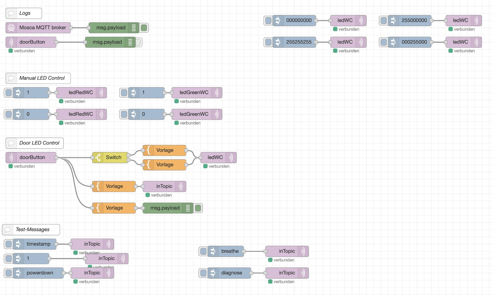
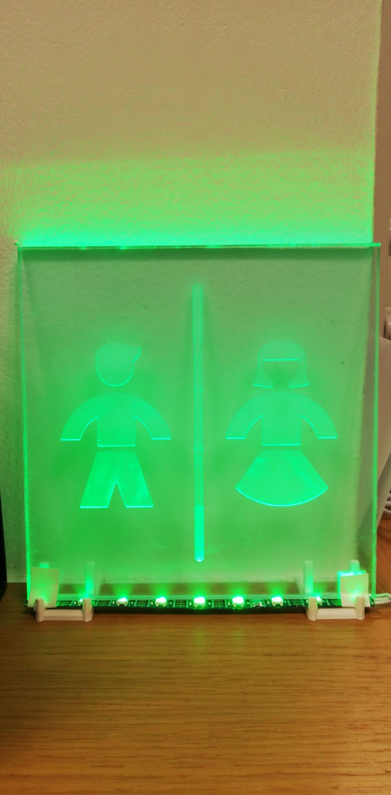
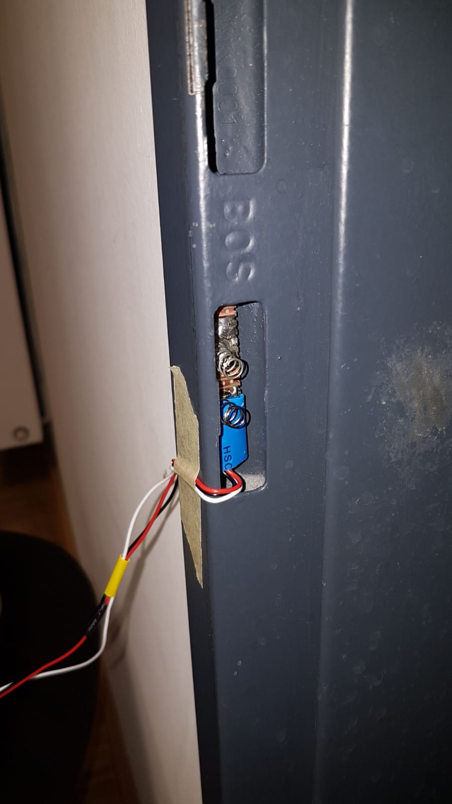
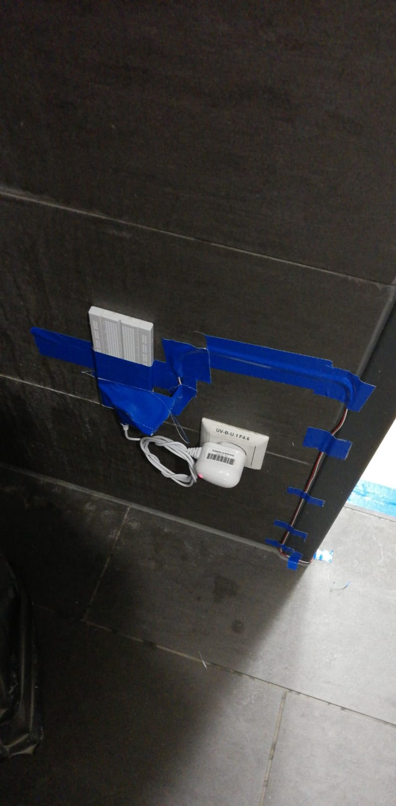
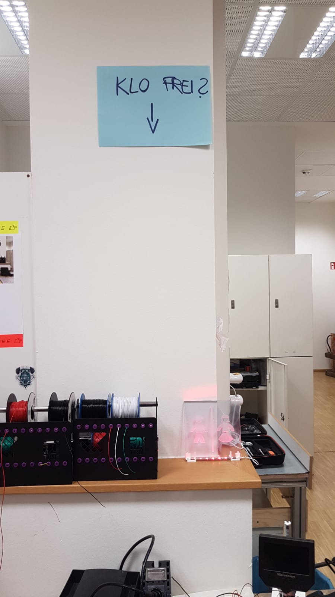

# Dokumentation
#### Wie du in sechs einfachen Schritten eine Tür smart machst.

### Benötigtes Material
- RaspberryPi
- ESP (3x)
- LED-Streifen
- Plexiglas (bspw. 15 x 15cm)
- Netzteile für RaspberryPi und ESPs
- Taster
- Widerstände (470kΩ)
- Kondensatoren (100µF)
- Magnet
- Feder (die leitet)
- Klebeband
- Schrumpfschläuche
- Jumper wires
- Kabel (3 versch. Farben)

### Schritt 1 -Idee
Unsere Idee war es, den Klostatus des IoT Lab auf einem Waveshare 7.5" anzuzeigen. Dabei soll ein Interface geschaffen werden, auf dem schnell und deutlich ersichtlich ist, ob das Klo frei oder bereits besetzt ist.

### Schritt 2 -Vorbereitungen
Zunächst haben wir zwei Rasperry Pi's über Balena durch Wifi miteinander verbunden.
Mithilfe von Balena Edger haben wir anhand einer SD-Karte die Rasperry Pis geflashed.

Nachdem das System auf den Raspberry Pis lief, haben wir uns dem Bildschirm gewidemt. Zunächst versuchten wir, einfache Grafiken auf dem Bildschirm darzustellen.
Dies diente zum Ausprobieren der Refresh-time. 
Nachdem wir feststellen mussten, dass das Display sehr viel Zeit benötigt, um eine Änderung vorzunehmen, entschieden wir uns gegen das Display.
Stattdessen war die Idee jetzt, anhand von LEDs den Klostatus anzuzeigen, da es mit dem Display wenig Sinn gemacht hätte (ggf. wäre schon wieder jemand auf dem Klo, bevor das Display überhaupt den freien Status komplett angezeigt hätte).

#### Node flow
Hier unseren Node flow. 

### Schritt 3 -weiterer Verlauf
Während der Umsetzung des Projekts nutzten wir das Programm Arduino um den Code auf die ESPs zu laden. Bislang nutzten wir für die Umsetzung nur LEDs auf dem Steckbrett, um den Code zu testen.
Da unser Ziel war, den Klostatus in einem Raum darzustellen, musste eine größere Skalierung des Projekts umgesetzt werden. Die LEDs auf dem Steckbrett waren dafür leider zu klein.

So entschieden wir uns für die finale Umsetzung ein Schild aus Plexiglas anzufertigen, das den Klostatus mithilfe von einem LED-Streifen farblich darstellt. 

-BILD AUFBAU-

### Schritt 4 -Umsetzung und Gestaltung des Schildes
Für die Umsetzung des Schildes entschieden wir uns für ein Icon von thenounproject.com. 
Dies wurde auf das Schild gelasert, wodurch es dank Beleuchtung besser sichtbar wurde. Im Raum stand auch die Option, das Glas zu bedrucken, jedoch wurde davon abgesehen.

### Schritt 5 -Aufsetzen und Verbinden der Komponenten
Nachdem das Schild für das fertige Produkt bereit war, mussten wir nur noch die einzelnen Komponenten an den richtigen Plätzen anbringen. Da der Taster für den Innenraum des Schlosses zu unzuverlässig war, wurde nach einer Lösung hierfür gesucht.
Letztendlich setzten wir dies mithilfe einer Feder um, die das Signal weiterleitet und sensibel auf Druck reagiert.
-BILD STECKBRETT-

### Schritt 6 -Einbau der Komponenten
Zunächst versuchten wir, die Platine mit dem Sensor in die Türe reinzukleben. Dies stellte sich allerdings als weniger praktisch dar, da wir für weitere Verbesserungen ggf. die Platine wieder aus der Tür holen müssen und der Kleber teilweise nicht fest genug in der Tür hielt.
So entschieden wir uns, die Platine hinten mit einem Magneten zu versehen, um es nachhaltiger einzubauen, so lässt es sich relativ einfach wieder aus der Tür entfernen. 
Gleichzeitig hält es durch den Magneten besser.

Da wir den ESP bislang noch nicht anders als durch ein Netzteil betreiben können, musste dieser nahe einer Steckdose platziert werden. In Zukunft planen wir dies durch eine Batterie zu betreiben. Dadurch wären wir auch unabhängig von einer nahegelegenen Steckdose.

### Das fertige Produkt

## node red installieren auf dem Mac
https://nodered.org/docs/getting-started/local